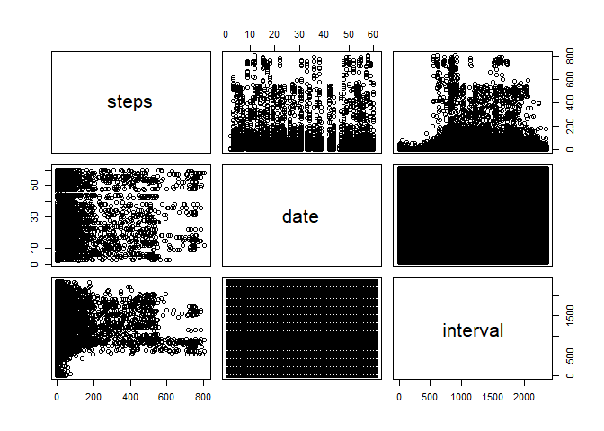

## Loading and preprocessing the data


```r
library(ggplot2)

unzip("./activity.zip")

activityData <- read.csv("./activity.csv")


names(activityData)
```

```
## [1] "steps"    "date"     "interval"
```

```r
summary(activityData)
```

```
##      steps                date          interval     
##  Min.   :  0.00   2012-10-01:  288   Min.   :   0.0  
##  1st Qu.:  0.00   2012-10-02:  288   1st Qu.: 588.8  
##  Median :  0.00   2012-10-03:  288   Median :1177.5  
##  Mean   : 37.38   2012-10-04:  288   Mean   :1177.5  
##  3rd Qu.: 12.00   2012-10-05:  288   3rd Qu.:1766.2  
##  Max.   :806.00   2012-10-06:  288   Max.   :2355.0  
##  NA's   :2304     (Other)   :15840
```

```r
pairs(activityData)
```

<!-- -->


## What is mean total number of steps taken per day?

```r
stepsPerDay <- aggregate(steps~ date, activityData,sum, na.rm = TRUE)

hist(stepsPerDay$steps, xlab = "Number of Steps Taken per Day", ylab ="Frequency", col ='blue', main = 'Total Steps Taken per Day')
```

<!-- -->

```r
meanStepsPerDay <- mean(stepsPerDay$steps)
meanStepsPerDay
```

```
## [1] 10766.19
```

```r
medianStepsPerDay <- median(stepsPerDay$steps)
medianStepsPerDay
```

```
## [1] 10765
```


## What is the average daily activity pattern?


```r
stepsPerDay$date <- as.Date(stepsPerDay$date,format="%Y-%m-%d"  )

timeSeriesPlot <- ggplot(stepsPerDay, aes(x=date,y= steps ) )+ geom_line (col = 'blue' )+scale_x_date() +ylim (c(0,20000 )) + xlab("Date") + ylab ("Average Number ofo Steps")+ ggtitle("Time Series Data")

timeSeriesPlot
```

<!-- -->

```r
stepsPerInterval<-aggregate(steps~interval, data=activityData, mean, na.rm=TRUE)

max5minInterval <- stepsPerInterval[which.max(stepsPerInterval$steps),]$interval

max5minInterval
```

```
## [1] 835
```


## Imputing missing values

```r
NoOfMissingValues <- sum( is.na( activityData$steps))

NoOfMissingValues
```

```
## [1] 2304
```
** The strategy is to replace the missing values with the mean per interval value. Below is the **


```r
getMeanStepsPerInterval <- function(interval) {
  stepsPerInterval[stepsPerInterval$interval == interval,]$steps
  
}

NewActivityData <- activityData

for ( i in  1:nrow( NewActivityData) ){
  if (is.na(NewActivityData[i,]$steps)){
    NewActivityData[i,]$steps <- getMeanStepsPerInterval(NewActivityData[i,]$interval )
  }
}


stepsPerDayNew <- aggregate(steps~ date, NewActivityData,sum, na.rm = TRUE)

hist(stepsPerDayNew$steps, xlab = "Number of Steps Taken per Day", ylab ="Frequency", col ='blue', main = 'Total Steps Taken per Day')
```

<!-- -->

## Are there differences in activity patterns between weekdays and weekends?


```r
NewActivityData$date <- as.Date(strptime(NewActivityData$date, format = "%Y-%m-%d"))

NewActivityData$day <- weekdays(NewActivityData$date)

for ( i in  1:nrow( NewActivityData) ){
  if (NewActivityData[i,]$day %in% c('Saturday','Sunday') ){
    NewActivityData[i,]$day <- 'Weekend'
  }
  else{
    NewActivityData[i,]$day <- 'Weekday'
  }
}

stepsPerDayNew <- aggregate(steps ~ interval+day, NewActivityData, mean ,na.rm = T)


plot2 <- ggplot(stepsPerDayNew,aes(x= interval, y= steps, col = day ))+ geom_line() + xlab('Interval')+ ylab('Steps') + ggtitle('Difference between Weekdays and Weekends')

plot2
```

<!-- -->
